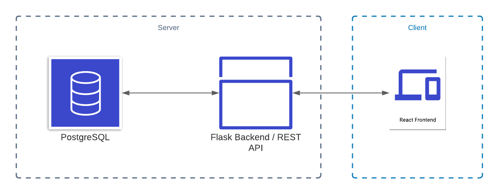
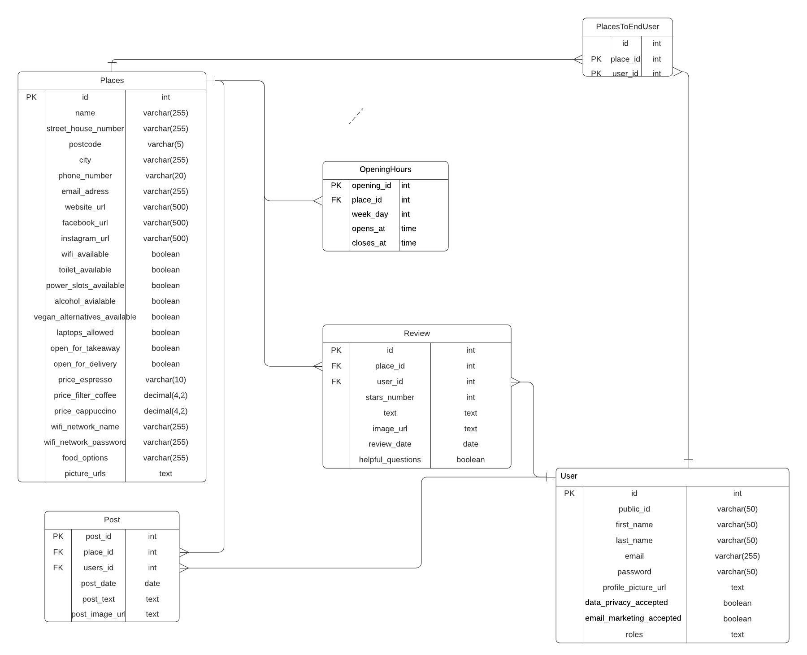

# coffeemap.berlin

>Discover new cafés in Berlin 

**Table of content**
- [coffeemap.berlin](#coffeemapberlin)
  - [About](#about)
  - [Architectural overview](#architectural-overview)
    - [Database schema](#database-schema)
  - [Getting started](#getting-started)
    - [Requirements:](#requirements)
    - [Setup for local development](#setup-for-local-development)

## About
The goal of this project is to make it easier to discover new cafés in Berlin. To do this you can add on coffeemap.berlin new cafes and discover added cafés. In a later version of the application it will be also possible to review cafés and café owner will get the possibility to create posts e.g. for news about their café. It is also planned to add new discovery features e.g. a search and map. 

If you are interested in contributing to this project reach out to @lukasmenzel. 

## Architectural overview

### Database schema
I am using POSTGRESQL to store the data of the cafés (places), users and all other related data. 

## Getting started

### Requirements:

| dependency                                                      | version                                                            |
| :----------------------------------------------------------- | :----------------------------------------------------------------- |
| [`python`](https://www.python.org/downloads/)                       | `v3.9.4`                                                    |
| [`NodeJS`](https://nodejs.org/en/download/)                       | `v14.16.1`                                                    |

### Setup for local development 

Instructions for macOS and Linux distributions assume you are using a Bash shell. Instructions for Windows assume you are using the Command Prompt. Instructions for other shells can be found online. 

**General Instructions** 

- Clone repo [https://github.com/lukas-menzel/coffeemap.git](https://github.com/lukas-menzel/coffeemap.git)
  
**Frontend:**

1. Install all dependencies `yarn install`

2. Run the application in development mode `yarn start` (runs on localhost:3000)

3. To deploy to production you can create a minified bundle `yarn run build`

**Backend:**

1. Install your virtual environment for this projekt: 
    `python3 -m venv venv`
  
2. Activate your virtual environment for this project: 
   
    macOS/Linux: `source venv/bin/activate`
    
    Windows: `venv\Scripts\activate.bat`

3. Download the Python modules listed in requirements.txt using pip. In case you are running Windows, uwsgi isn't availiable, so uncomment it in the requirements.txt. (uWSGI==2.0.19.1 => #uWSGI==2.0.19.1) before you execute the following command:
  
    `pip install -r requirements.txt`

4. Point Flask to your application: 

    macOS/Linux:  `export FLASK_APP=__init__.py`
    
    Windows: `set FLASK_APP=__init__.py`
  
5. Enable hot reloading, debug mode, and other useful features for local development:  

     macOS/Linux: `export FLASK_ENV=development`

    Windows: `set FLASK_ENV=development`
  
6. run your flask application: 

    `flask run`

